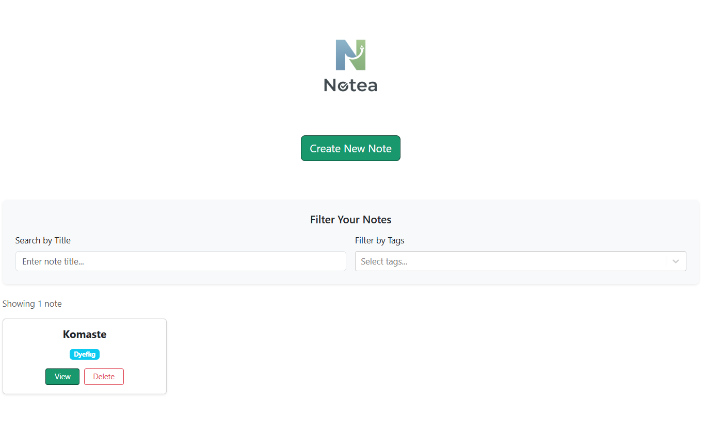
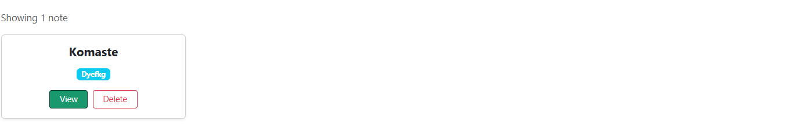

# Notea - Note Taking Application

A note-taking application built with React, TypeScript, and Bootstrap.

## Features

- Create, view  and delete notes
- Tag system for organizing notes
- Filter notes by title and tags
- Markdown support for rich text formatting
- Image upload with paste support
- Local storage persistence
- Responsive design

## Technologies Used

- **React** - UI library
- **TypeScript** - Type safety
- **React Router** - Navigation
- **Bootstrap** - Styling framework
- **React Select** - Tag selection
- **React Markdown** - Markdown rendering
- **Vite** - Build tool
- **Vitest** - Testing framework

## Installation

1. Clone the repository
```bash
git clone 
cd notea
```

2. Install dependencies
```bash
npm install
```

3. Run the development server
```bash
npm run dev
```

4. Open your browser and navigate to `http://localhost:5173`


## Usage

### Creating a Note
1. Click "Create New Note" button
2. Enter a title and content (markdown supported)
3. Add tags for organization (optional)
4. Click "Save"


### Viewing Notes
- All notes are displayed on the home page as cards
- Click "View" on any note card to see full details


### Filtering Notes
- Use the search bar to filter by title
- Select tags to filter notes by specific tags


### Deleting Notes
- Click "Delete" button on note cards or in note detail view
- Confirm deletion when prompted


## Testing

Run tests with:
```bash
npm test
```


Run tests with UI:
```bash
npm run test:ui
```


## Project Structure
```
src/
├── components/
│   ├── App.tsx          # Main app component
│   ├── NewNote.tsx      # New note page
│   ├── Note.tsx         # Individual note view
│   ├── NoteForm.tsx     # Note creation/edit form
│   └── NoteList.tsx     # Home page with note cards
├── test/
│   ├── setup.ts         # Test configuration
│   ├── Note.test.tsx       # Test files 
│   └── NoteForm.test.tsx       # Test files
├── assets/
│   └── Notea_Logo.png   # App logo
└── main.tsx             # App entry point
```

## Features in Development

- [ ] View or delete existing notes
- [ ] Tag deletion
- [ ] Search with advanced filters


## Author

Albi Berberi